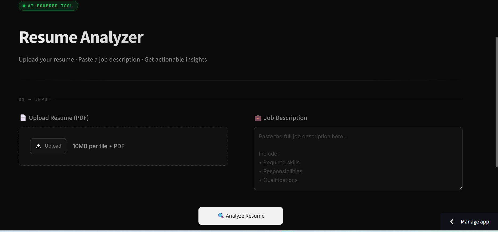
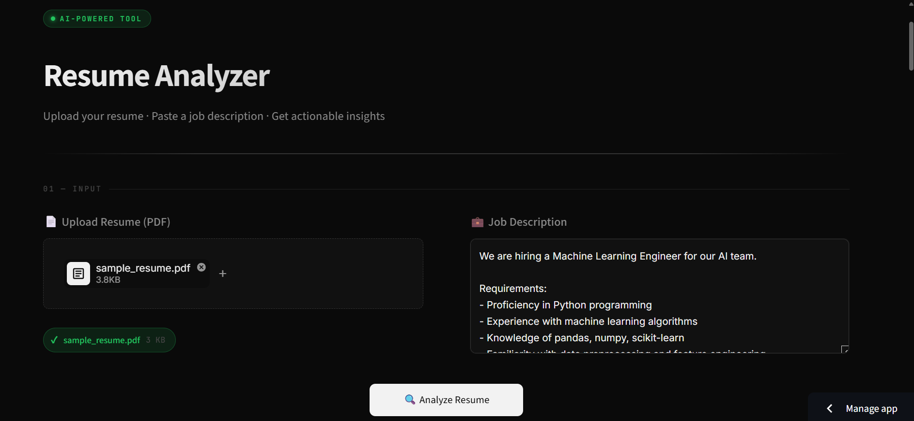
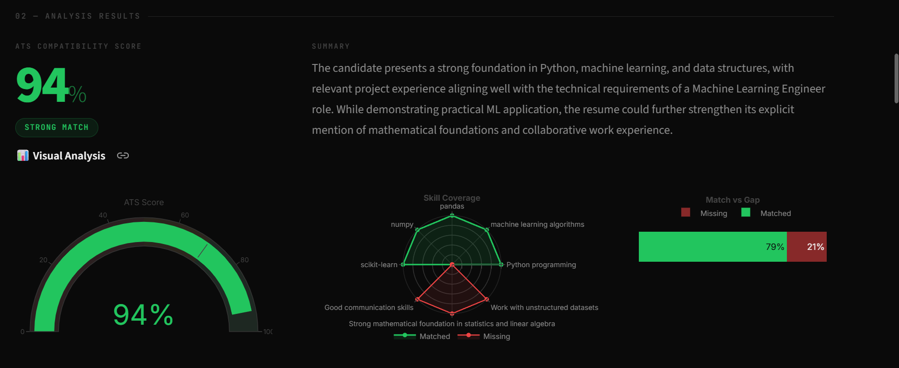
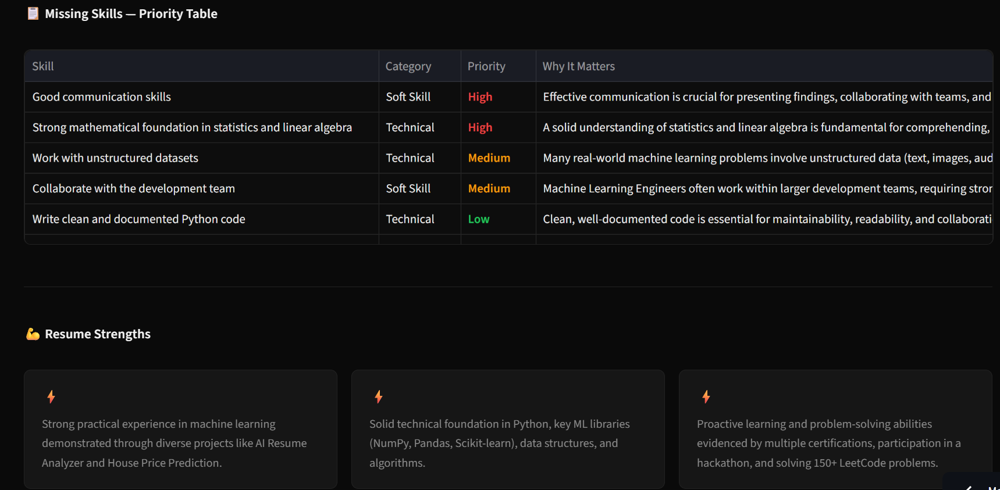
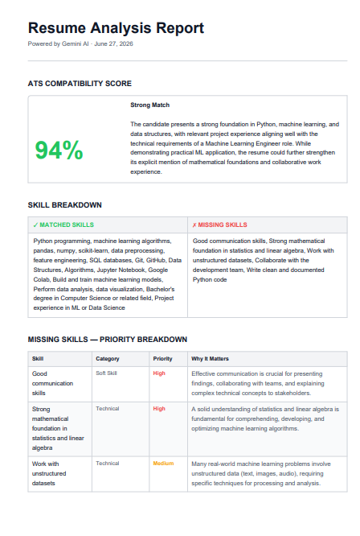

# 📄 AI Resume Analyzer

An AI-powered Resume Analyzer built with **Python, Streamlit, and Google Gemini 2.5 Flash** that evaluates resumes against job descriptions, calculates ATS compatibility, identifies skill gaps, provides personalized recommendations, and generates professional PDF reports.

---

## 🌐 Live Demo

**Try the application here:**

https://ai-resume-analyzer-7vqq9cx5vfpz2uagllrykp.streamlit.app/


## ✨ Features

* 📄 Upload Resume in PDF format
* 💼 Paste any Job Description
* 🤖 AI-powered resume analysis using Google Gemini 2.5 Flash
* 📊 ATS Compatibility Score
* ✅ Matched Skills Detection
* ❌ Missing Skills Analysis
* 💪 Resume Strengths Identification
* 🛠 Personalized Improvement Suggestions
* 🗺 Personalized Learning Roadmap
* 📈 Interactive Visual Analytics
* 📑 Professional PDF Report Generation
* 📁 JSON Export of Analysis Results

---

## 🛠 Tech Stack

| Category               | Technologies                |
| ---------------------- | --------------------------- |
| Language               | Python                      |
| Framework              | Streamlit                   |
| AI Model               | Google Gemini 2.5 Flash API |
| Data Visualization     | Plotly                      |
| PDF Processing         | PyMuPDF                     |
| PDF Report Generation  | ReportLab                   |
| Environment Management | python-dotenv               |

---

## 📂 Project Structure

```text
resume_analyzer/
│
├── .streamlit/
│   └── config.toml
│
├── components/
│   ├── charts.py
│   └── styles.py
│
├── utils/
│   ├── ats_scoring.py
│   ├── gemini_client.py
│   ├── pdf_reader.py
│   └── report_generator.py
│
├── app.py
├── requirements.txt
├── .env.example
├── .gitignore
├── LICENSE
└── README.md
```

---

## 🚀 Installation

### 1. Clone the repository

```bash
git clone https://github.com/aniketkr-cs/AI-Resume-Analyzer.git
cd AI-Resume-Analyzer
```

### 2. Install dependencies

```bash
pip install -r requirements.txt
```

### 3. Create a `.env` file

```env
GEMINI_API_KEY=YOUR_GEMINI_API_KEY
```

Get your free Gemini API key from:

https://aistudio.google.com/app/apikey

### 4. Run the application

```bash
streamlit run app.py
```

---

## 📊 What the Analyzer Provides

After analyzing a resume, the application generates:

* ATS Compatibility Score
* AI-generated Resume Summary
* Matched Skills
* Missing Skills
* Resume Strengths
* Improvement Suggestions
* Personalized Learning Roadmap
* Interactive Charts
* Downloadable PDF Report
* Downloadable JSON Report

---

## 📸 Screenshots

### 🏠 Home Screen



---

### 📄 Resume Upload & Job Description



---

### 📊 AI Analysis Dashboard



---

### 💡 Skills Analysis & Recommendations



---

### 📑 Generated PDF Report


---

## 🔮 Future Improvements

* Resume history and saved reports
* Multiple resume comparison
* Semantic skill matching using embeddings
* AI-powered resume rewriting suggestions
* Cover letter generation
* Multi-language resume support

---

## 🤝 Contributing

Contributions, suggestions, and improvements are welcome.

Feel free to fork the repository and submit a pull request.

---

## 📄 License

This project is licensed under the MIT License.

---

## 👨‍💻 Author

**Aniket Kumar**

B.Tech Computer Science & Engineering Student 
Built as a portfolio project to demonstrate practical skills in AI application development, prompt engineering, API integration, data visualization, PDF processing, and software engineering.
